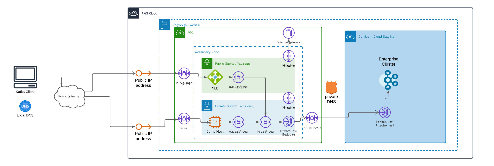

# atg_cc_enterprise_via_nlb


Uses a NLB on AWS to expose a Confluent Cloud Enterprise cluster with a public endpoint

### Prerequisites

1. AWS client configured so that the *hashicorp/aws* provider can create resources in your AWS account.
2. A Confluent Cloud API key in order to create resources in your CC Organization.
3. The `netcat/nc` tool installed and on your path in order to test network connectivity to CC
4. ssh-keygen installed in order to create a keypair to access the jump-host on AWS
4. Confluent CLI installed (optional)

### What does this Terraform setup do?

1. Creates an Enterprise cluster in Confluent Cloud. This cluster can only be accessed via a private network connection.
2. Creates a VPC in your account containing two subnets one *public*, the other *private*
4. Creates a Private Link endpoint for the Confluent Cloud Network and places in the *private* subnet
5. Sets up a private DNS zone in order to resolve the CC FQDNs to the PL address
5. Instantiates a VM in the *private* subnet and gives it a public IP address
6. Creates a Network Load Balancer,assigns it a public IP address and attaches it to the *public* subnet
7. Sets the PL endpoint as the target for the NLB



Thus we end up with an NLB on the public internet which forwards traffic (on ports 443 (REST) and 9092 (Kafka)) to the PL endpoint which gives access to the Enterprise Cluster. In order for this to be useful it requires some DNS changes.

The purpose of the VM is to make it possible to test Kafka connectivity to the cluster via the private link. It's accessible via ssh. 

Any clients accessing the public endpoint need to resolve both the bootstrap FQDN (which has the form `<lkc_id>.<region>.<csp>.private.confluent.cloud`) and all the broker FQDNs (of the form <lkc_id>_<broker_hex>.<region>.<csp>.private.confluent.cloud`)) to the public IP address of the NLB. This requires a wildcard mapping in the DNS, which can be accomplished in dnsmasq with an entry like
```
address=/eu-west-1.aws.private.confluent.cloud/34.242.88.53
```

NB! this is just a proof-of-concept, so it only uses a single AZ with a single Private Link endpoint. This is a single point of failure. For production use it would need to be extended to use at least 2 of the possible 3 PL endpoints to connect to the Confluent Cloud Network that the cluster is in. The ingress security groups on the NLB and jumphost should also be tightened up as much as possible.

### Notes

Before running Terraform, create a keypair for the jumphost
```shell
cd aws/jump-host
ssh-keygen -t rsa -b 4096 -m pem -f jumphost_kp && openssl rsa -in jumphost_kp -outform pem && chmod 400 jumphost_kp
cd ../..
```

This set-up uses the `CONFLUENT_CLOUD_API_KEY` and `CONFLUENT_CLOUD_API_SECRET` environment variables to authorise itself to create clusters, topics, API keys for cluster access etc. This must be a [cloud api key](https://support.confluent.io/hc/en-us/articles/11113978002836-What-are-the-differences-of-Cloud-API-Keys-Cluster-Resource-specific-API-Keys)

Before running Terraform, set the following variables
```shell
export CONFLUENT_CLOUD_API_KEY="<cloud_api_key>"
export CONFLUENT_CLOUD_API_SECRET="<cloud_api_secret>"
export TF_VAR_owner=<email address to tag AWS resources>
export TF_VAR_region=<AWS region to use, defaults to eu-west-1/Ireland>
```

And then use Terraform to create the various AWS resources and create the Confluent Cloud Environment and Cluster.
```shell
terraform init
terraform plan
terraform apply
```

The last module `cc_dataplane` will be skipped in the first run as there is no DNS to resolve the Fully Qualified Domain Name of the bootstrap server to an accessible IP address.

At this stage the public IP address should have been set up, so you can access it via
```shell
terraform output endpoint_info
```

If you can add an entry in your local `/etc/hosts` file (or DNS) so that the FQDN of the cluster endpoint points to the public IP address then when you re-run `terraform apply` the API key generation should succeed and the topic will be created.

In order to be able to access the Kafka APIs (i.e. using a Kafka client) your DNS should resolve the wildcard `*.<region>.aws.private.confluent.cloud` to the public IP address of the NLB. Look at the `connection_info` output from Terraform to retrieve the newly create cluster API keys and some example commands for producing to and consuming from the topic using the [Confluent CLI tool](https://docs.confluent.io/confluent-cli/current/install.html).

```shell
terraform output connection_info
```


----

This repository is part of the Confluent organization on GitHub.
It is public and open to contributions from the community.

Please see the LICENSE file for contribution terms.
Please see the CHANGELOG.md for details of recent updates.


